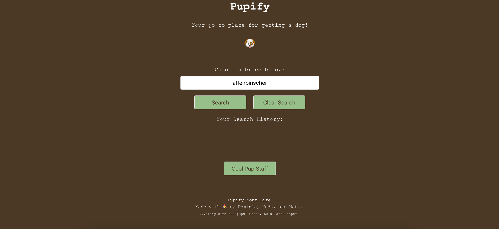
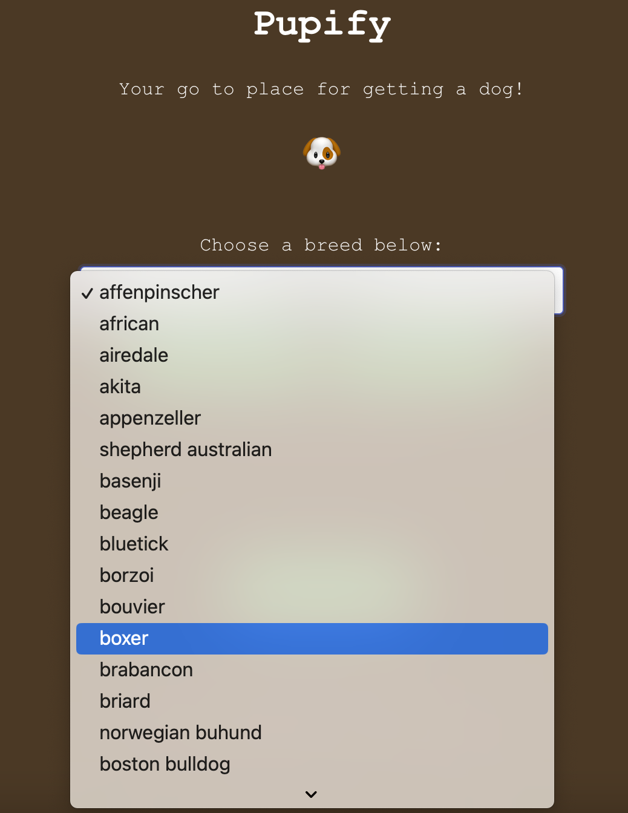
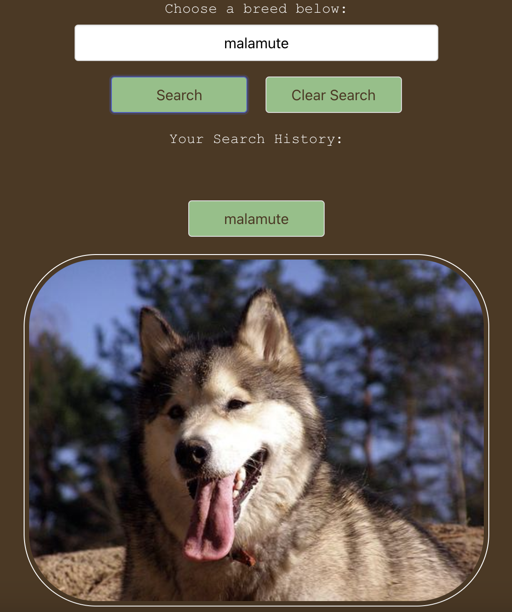
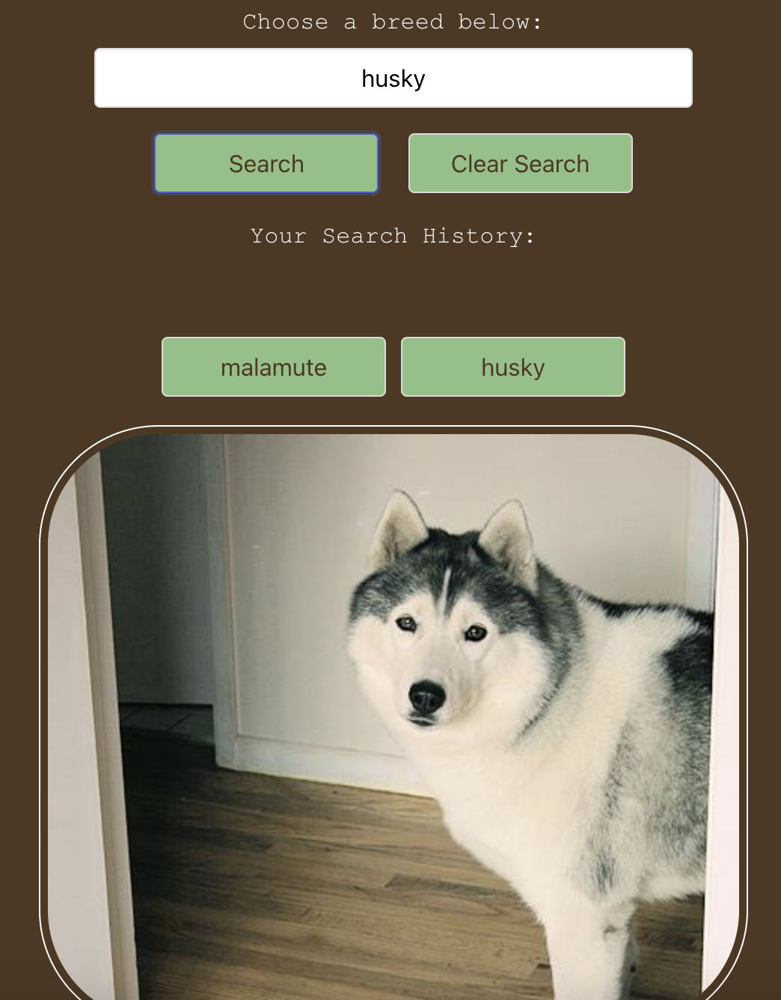
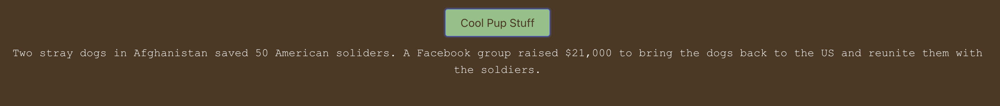
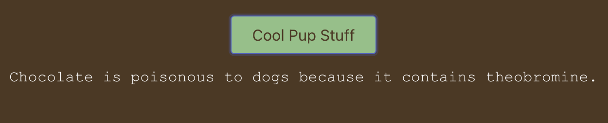

# Pupify :dog:

## Description :page_facing_up:

- This repo showcases a completed front-end project during the coding bootcamp with 2 other group members.
- The project was originally posted in teammate's repo, this has been reposted on my account to keep for reference.

-------------------------------------------------------------

- Pupify is a simple, easy to use, web app that allows the user to view images of over 140 different dog breeds.
- Pupify also gives the user various kinds of information regarding man’s best friend! Click the “cool pup stuff” button and learn all kinds of interesting things!
- Being dog parents ourselves, we wanted to create something as an homage to our pups who are always supporting us through this coding journey.
- The purpose of this web app is to help people who are thinking about getting a dog see what a particular breed looks like and learn some facts about dogs.

### User Story
- AS A person who is interested in getting a dog
- I WANT to see what a particular breed looks like and know some information about dogs
- SO THAT I can decide if I should to get a dog

## Usage :wrench:

- [Click here](https://mattoz.github.io/Pupify/) to navigate to the live link of this repository.
- You will also need to [click here](https://cors-anywhere.herokuapp.com/corsdemo) to request access to the demo server for the Dog fact API to show up. (You will also need to keep requesting it if Dog Fact is not showing since it only allows for a temporary access for a period of time).

-------------------------------------------------------------

- You will be presented with an interactive webpage:

-------------------------------------------------------------

- Click the dropdown menu to select a bread, then click search for an image of the breed you selected to show:

-------------------------------------------------------------

- If you search multiple breeds, you will have your selections stored in your searh history that you click on and display that breed again:

-------------------------------------------------------------

- If you click on "Cool Pup Stuff" it will display a dog fact, you can click as many times you would like to dosplay different fact:

-------------------------------------------------------------

## Features :confetti_ball:
- 2 Server-Side APIs
- CSS Framework
- Responsive Webpage
- Interactive Webpage
- Client-Side Storage
- Dropdown Search Menu
- Image Display
- Fact Display
- Styled Cursor
- Use of Emojis
- Use of Color Palettes

## Technologies Used :sparkles:

### APIs
- [Dog Pics](https://dog.ceo/dog-api)
- [Dog Facts](https://kinduff.github.io/dog-api/)
- [Request Access to proxy server](https://cors-anywhere.herokuapp.com/)

### Framework
- [Bulma](https://bulma.io/)

### Color Palette
- [Coolors](https://coolors.co/e3d26f-ca895f-a15e49-4e3822-2f1b25)

### Applications
- VS Code

## Challenges :tornado:
- Image API inconsistent display from their server.
- Need to request temporary access to demo server for the Dog Facts API.
- Search bar caused a syntax issue with user input due to spelling and casing issues. 

## Successes :star2:
- Functional deployed website that is interactive and responsive.
- Both APIs are connected successfully.
- CSS Framework is connected successfully.
- earch bar issue was resolved by turning it  into a dropdown menu to avoid spelling and casing issues.

## Future Development :bulb:
- If time was not a factor, we could have matched dog fact with the dog breed. This would require a more extensive API for the dog fact library.
- If money was not an issue as well, we would be able to get more thorough API data.

## Credit :medal_military:
- Bootcamp Instructor and TA.
- Bootcamp Materials.
- Bootcamp Class Video Recordings.

Thank you for visiting! :hibiscus:
